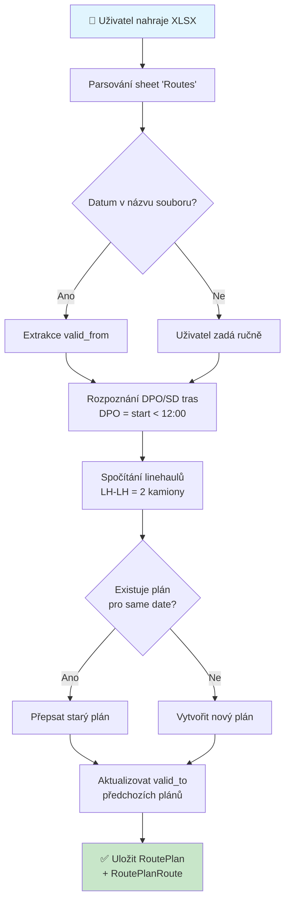
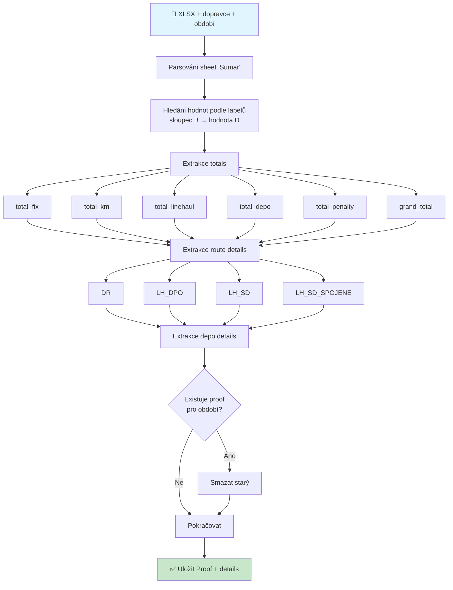
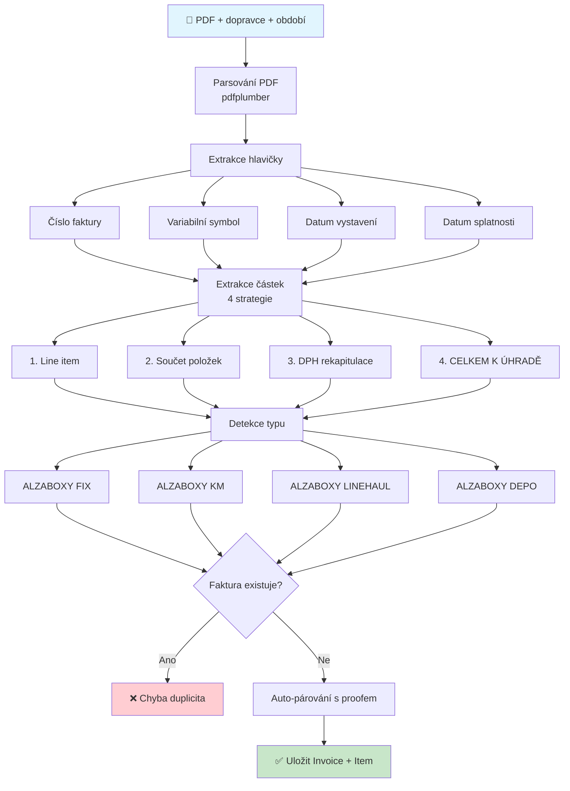
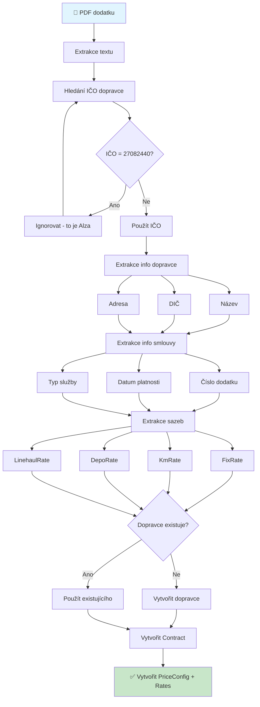
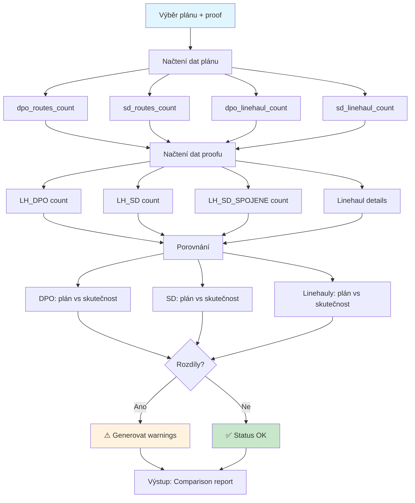
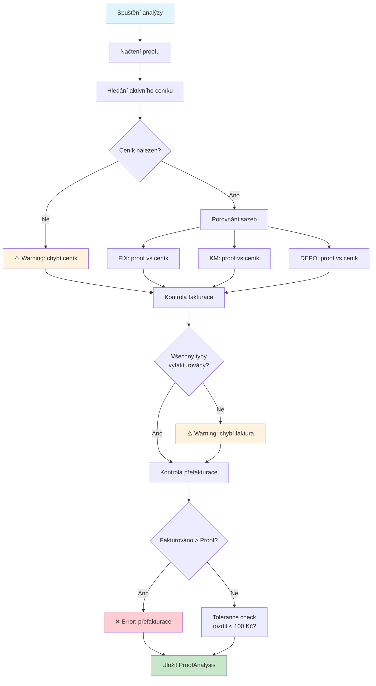
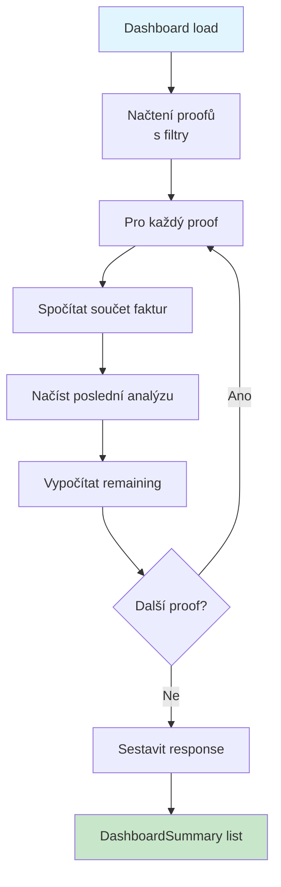

# Procesní diagramy - APLIKACE

## 1. Upload plánu tras

---

## 2. Upload proofu

---

## 3. Upload faktury

---

## 4. Upload smlouvy/dodatku

---

## 5. Porovnání plán vs. proof

---

## 6. Analýza proofu vs. ceník

---

## 7. Dashboard flow

