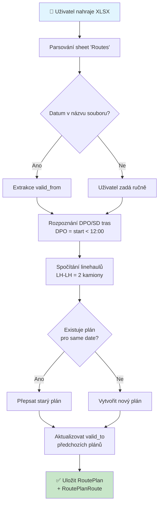
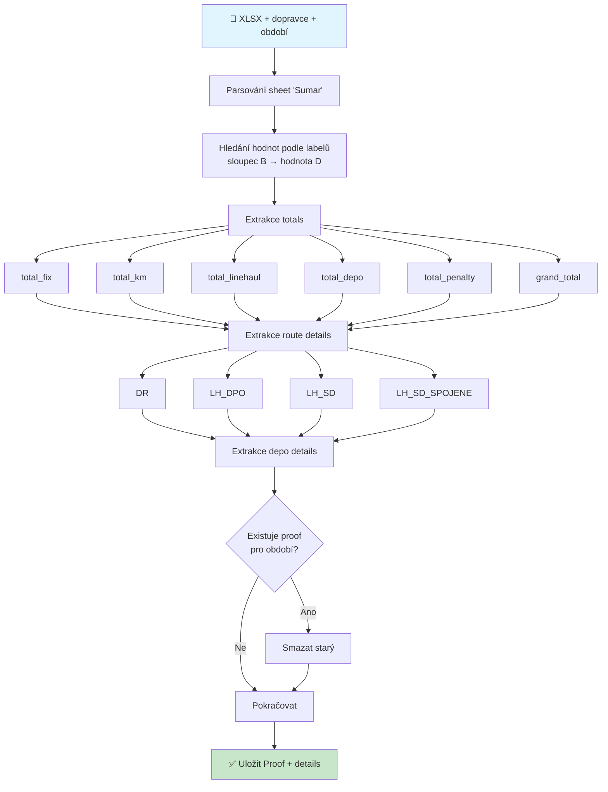
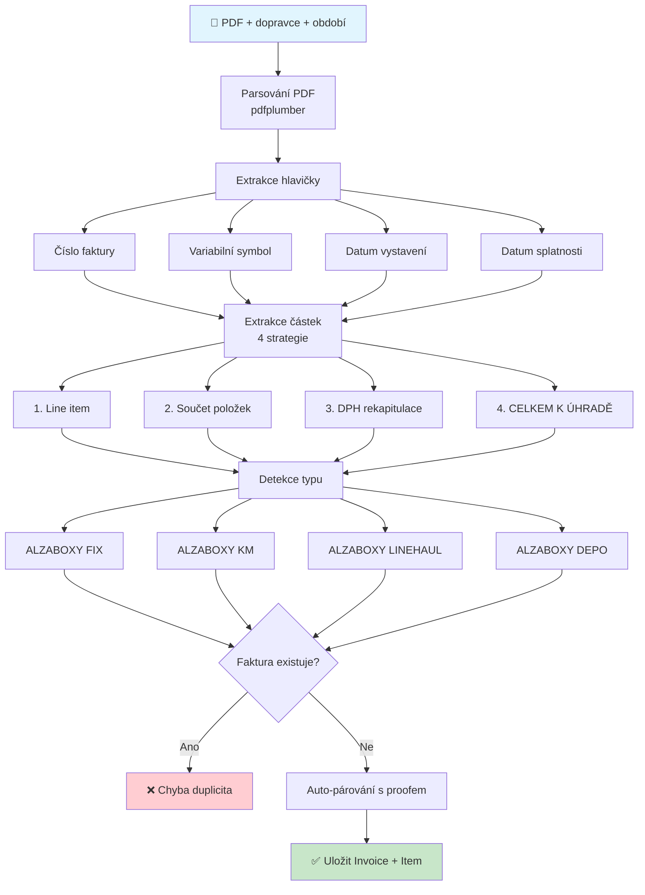
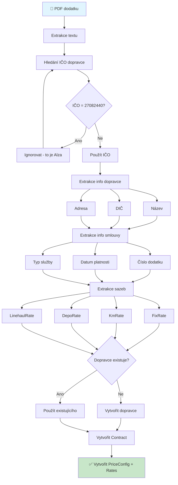
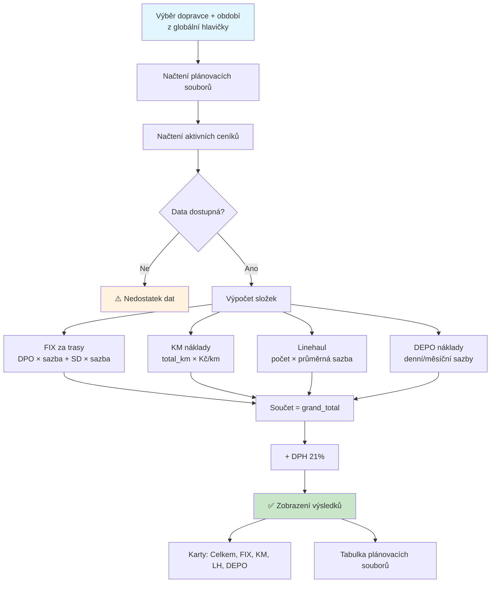
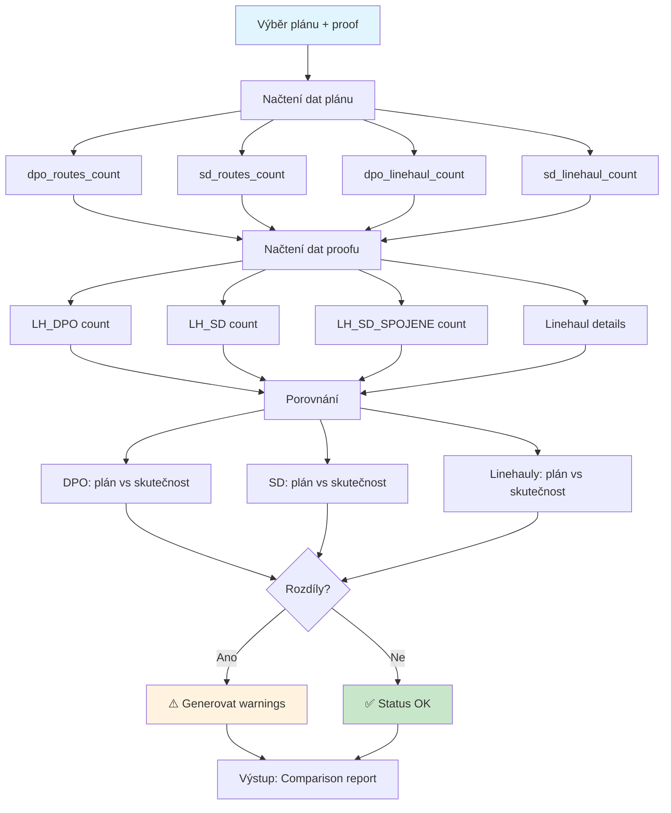
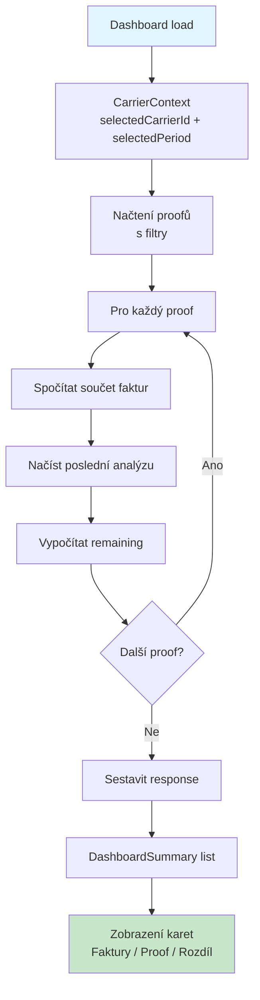
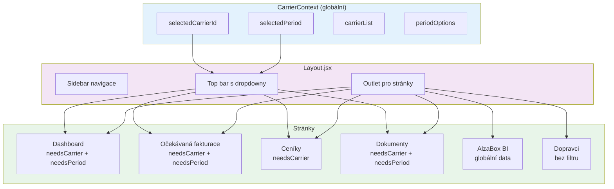

# Procesní diagramy - APLIKACE

> **Verze:** 3.11.0  
> **Datum:** Prosinec 2025

---

## 1. Upload plánu tras



---

## 2. Upload proofu



---

## 3. Upload faktury



---

## 4. Upload smlouvy/dodatku



---

## 5. AlzaBox Import (NOVÉ v3.10)

```mermaid
flowchart TD
    subgraph LOCATIONS ["Import lokací"]
        A1[📄 XLSX lokací] --> A2[Detekce sheetu<br/>LL_PS / Sheet1 / Data]
        A2 --> A3[Parsování sloupců]
        A3 --> A4[box_code, name, city<br/>GPS, carrier_code]
        A4 --> A5[Upsert AlzaBoxLocation]
    end
    
    subgraph DELIVERIES ["Import dojezdů"]
        B1[📄 XLSX dojezdů] --> B2[Detekce sheetů<br/>Actual + Plan]
        B2 --> B3[Datumy z row 2]
        B3 --> B4[Regex parser<br/>čas | název -- AB1234]
        B4 --> B5{Hlavička trasy?}
        B5 -->|Ano| B6[Uložit route_group]
        B5 -->|Ne| B7[Extrakce box_code + časy]
        B6 --> B4
        B7 --> B8[Párování s lokací]
        B8 --> B9[Uložit AlzaBoxDelivery]
    end
    
    A5 --> C[Dashboard statistiky]
    B9 --> C
    C --> D[Graf včasnosti<br/>on_time = actual ≤ planned]
    
    style A1 fill:#e1f5fe
    style B1 fill:#e1f5fe
    style D fill:#c8e6c9
```

---

## 6. Očekávaná fakturace (NOVÉ v3.10)



---

## 7. Porovnání plán vs. proof



---

## 8. Dashboard flow



---

## 9. Frontend State Management



---

## 10. API Routing Architecture

```mermaid
flowchart LR
    subgraph FRONTEND ["Frontend"]
        F1[api.js<br/>axios instance]
    end
    
    subgraph BACKEND ["Backend - main.py"]
        M[FastAPI App]
        M --> R1[/api/auth]
        M --> R2[/api/carriers]
        M --> R3[/api/contracts]
        M --> R4[/api/prices]
        M --> R5[/api/proofs]
        M --> R6[/api/invoices]
        M --> R7[/api/alzabox]
        M --> R8[/api/expected-billing]
    end
    
    subgraph DATABASE ["PostgreSQL"]
        DB[(Database)]
    end
    
    F1 --> M
    R1 & R2 & R3 & R4 & R5 & R6 & R7 & R8 --> DB
    
    style FRONTEND fill:#e1f5fe
    style BACKEND fill:#fff3e0
    style DATABASE fill:#c8e6c9
```

---

*Diagramy vygenerovány pro TransportBrain v3.11.0*
