# Procesní diagramy - APLIKACE

> **Verze:** 3.0.0  
> **Aktualizace:** Prosinec 2025 - nová struktura UI

---

## 0. Přehled aplikace

### Struktura navigace

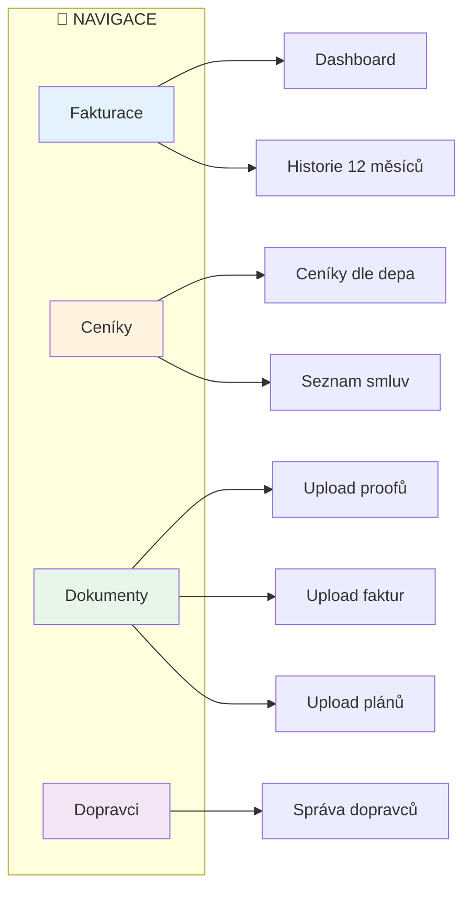

### Budoucí rozšíření

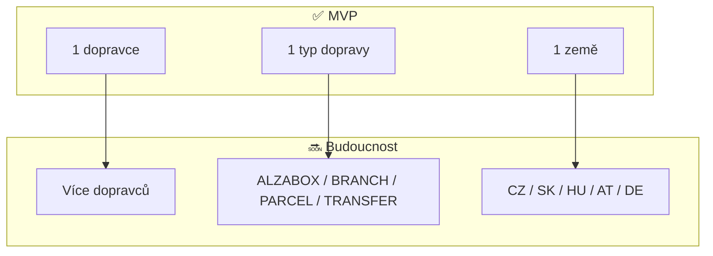

---

## 1. Upload plánu tras

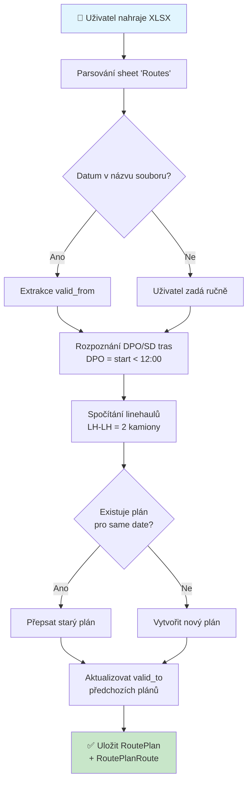

---

## 2. Upload proofu

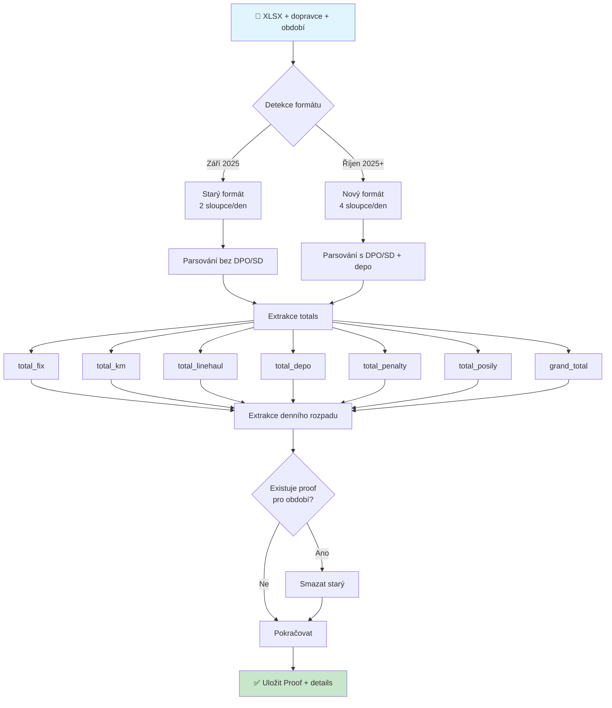

**Dual-format podpora:**
- Automatická detekce podle struktury hlavičky
- Dynamické hledání sloupců s hodnotami

---

## 3. Upload faktury

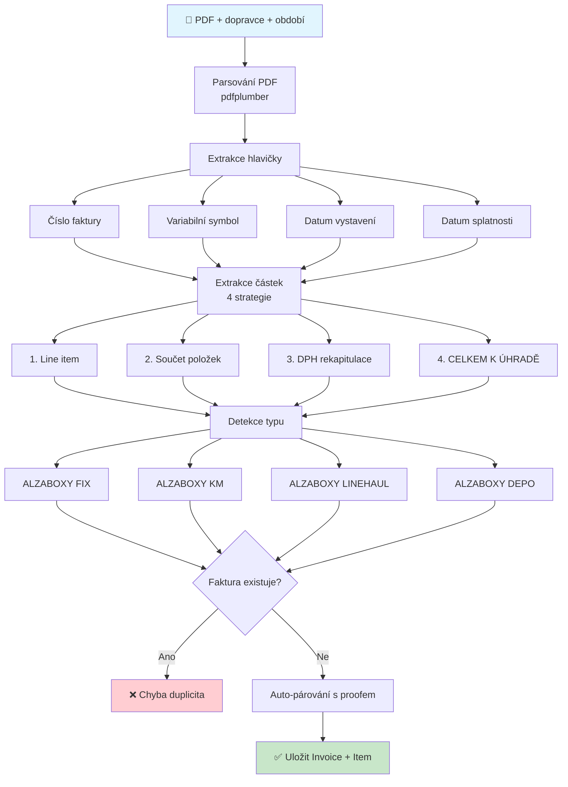

---

## 4. Upload smlouvy/dodatku

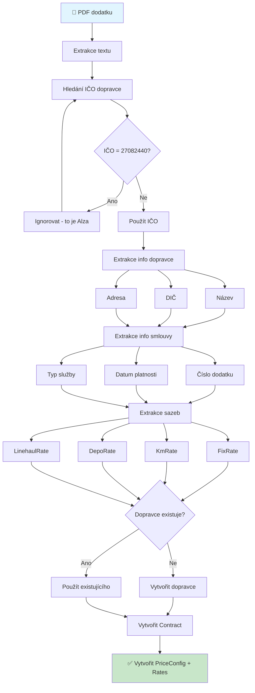

---

## 5. Dashboard - Fakturace

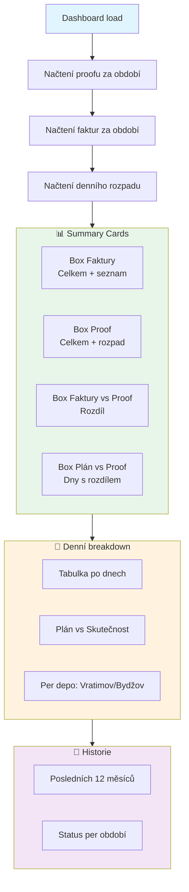

---

## 6. Porovnání plán vs. proof

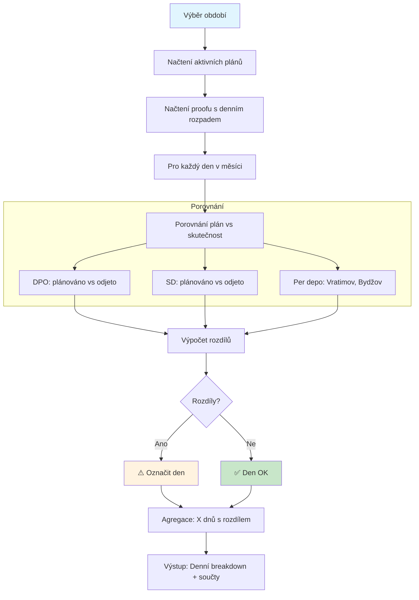

---

## 7. Stránka Ceníky

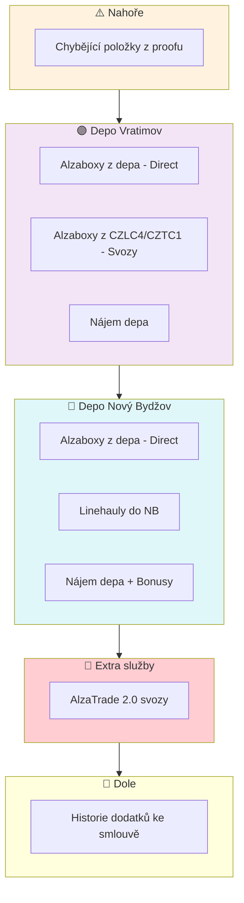

**Badge dodatku u každé ceny:**
- `D7`, `D8`, `D9`, `D12`, `D13` = číslo dodatku
- `?` = chybí ve smlouvách

---

## 8. Stránka Dokumenty

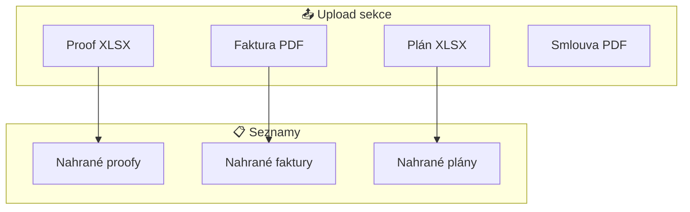

---

## 9. API Endpoints

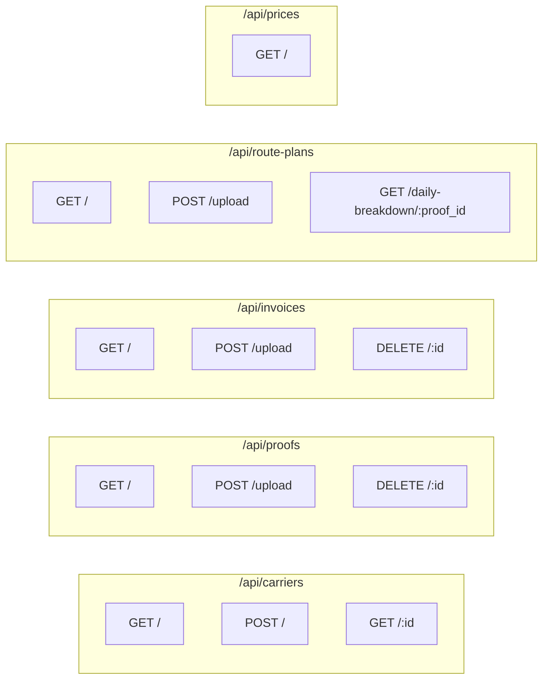

---

## 10. Tech Stack

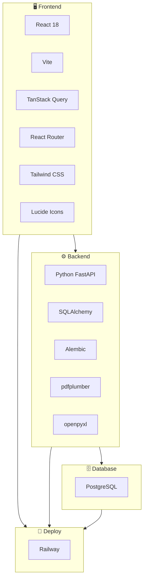

---

*Dokument aktualizován pro Transport Tycoon v3.0*
