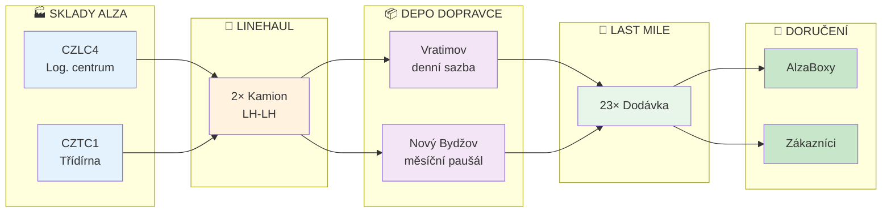
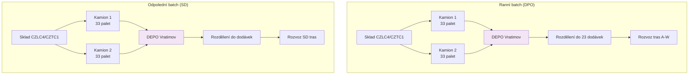
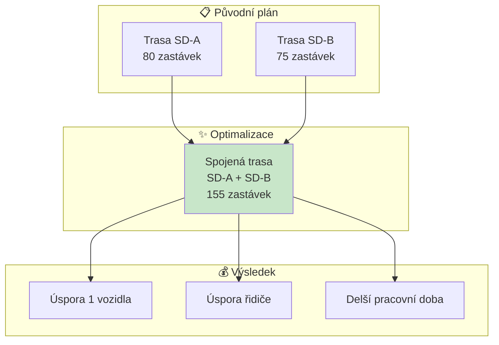
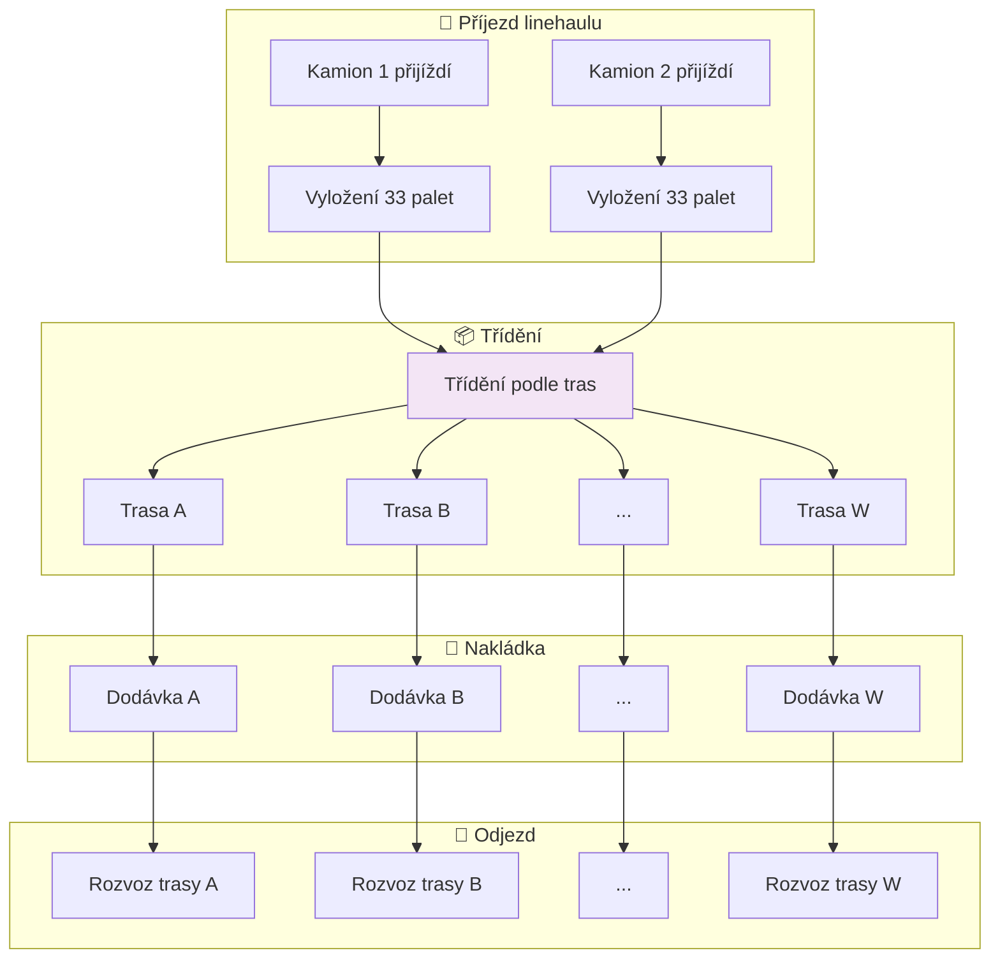
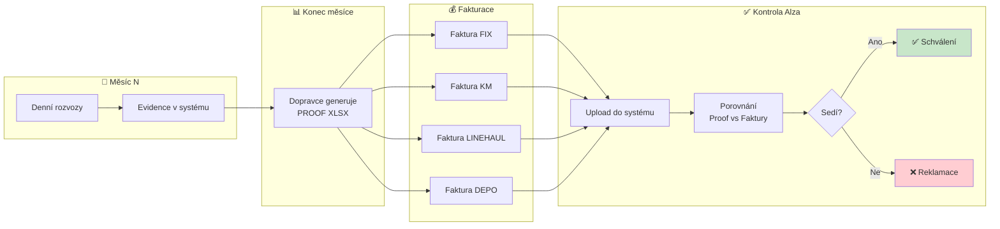
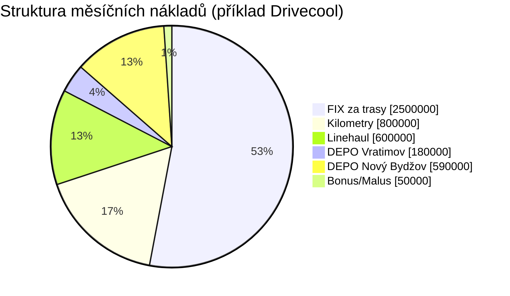
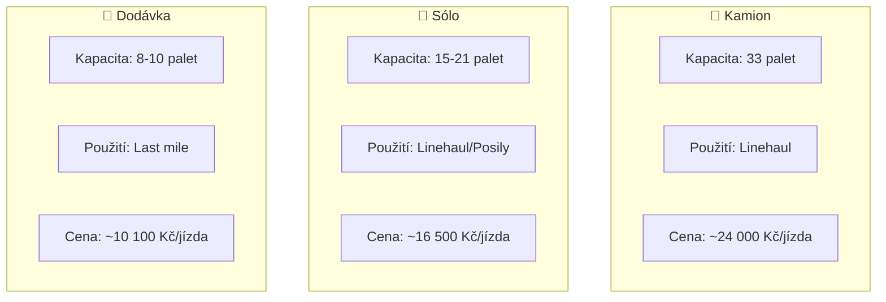
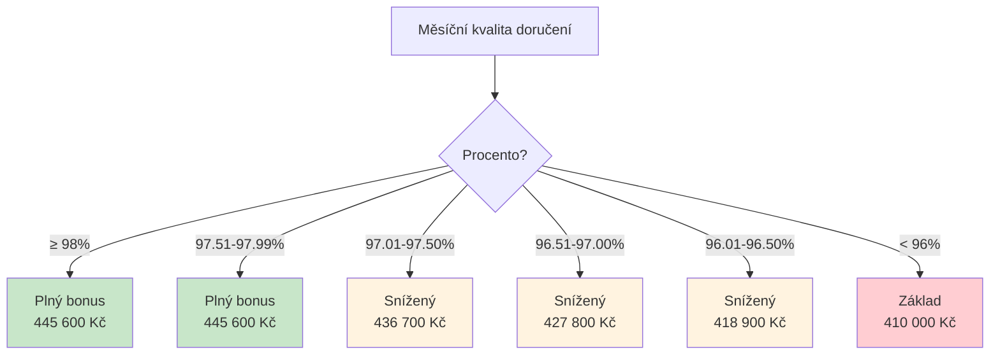

# Procesní diagramy - DOPRAVA / LOGISTIKA

## 1. Hlavní tok zboží

---

## 2. Typy rozvozů - přehled

```mermaid
flowchart TD
    subgraph DPO ["☀️ DPO - Ranní rozvoz"]
        A1[📱 Objednávka<br/>do půlnoci] --> A2[📦 Expedice<br/>po půlnoci]
        A2 --> A3[🚛 Linehaul<br/>cca 2:00-4:00]
        A3 --> A4[📦 Překládka<br/>na DEPU]
        A4 --> A5[🚐 Rozvoz<br/>od 7:00]
    end
    
    subgraph SD ["🌙 SD - Same Day"]
        B1[📱 Objednávka<br/>ráno] --> B2[📦 Expedice<br/>odpoledne]
        B2 --> B3[🚛 Linehaul<br/>cca 12:00-14:00]
        B3 --> B4[📦 Překládka<br/>na DEPU]
        B4 --> B5[🚐 Rozvoz<br/>od 16:00]
    end
    
    subgraph DR ["⚡ DR - Direct Route"]
        C1[📦 Speciální<br/>zásilka] --> C2[🚐 Přímý rozvoz<br/>ze skladu]
        C2 --> C3[📍 Doručení<br/>bez DEPA]
    end
    
    style A5 fill:#c8e6c9
    style B5 fill:#c8e6c9
    style C3 fill:#c8e6c9
```

---

## 3. Linehaul detail (LH-LH)

**Klíčové pravidlo:** LH-LH = 2 kamiony pro CELÝ batch, NE per trasa!

---

## 4. Spojené trasy (LH_SD_SPOJENE)

---

## 5. DEPO operace

---

## 6. Časová osa dne

---

## 7. Fakturační tok

---

## 8. Struktura nákladů

---

## 9. Typy vozidel

---

## 10. Bonusový systém (Nový Bydžov)

