# Procesní diagramy - DOPRAVA / LOGISTIKA

> **Verze:** 3.0.0  
> **Aktualizace:** Rozšíření o typy doprav a země

---

## 0. Přehled typů doprav a zemí

### Typy doprav Alza

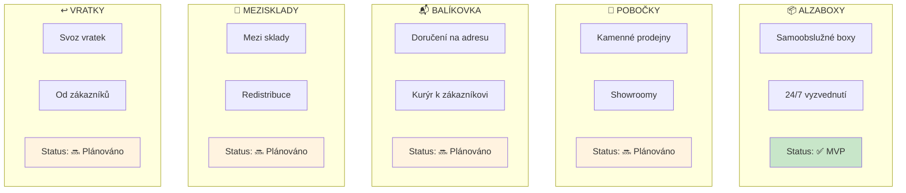

### Země operací

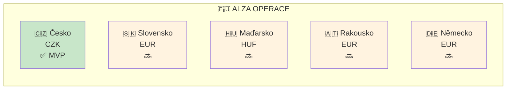

---

## 1. Hlavní tok zboží (Alzaboxy CZ)

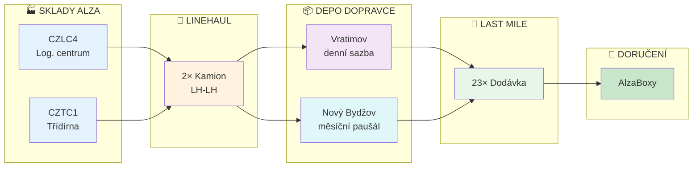

---

## 2. Typy rozvozů - přehled

```mermaid
flowchart TD
    subgraph DPO ["☀️ DPO - Ranní rozvoz"]
        A1[📱 Objednávka<br/>do půlnoci] --> A2[📦 Expedice<br/>po půlnoci]
        A2 --> A3[🚛 Linehaul<br/>cca 2:00-4:00]
        A3 --> A4[📦 Překládka<br/>na DEPU]
        A4 --> A5[🚐 Rozvoz<br/>od 7:00]
    end
    
    subgraph SD ["🌙 SD - Same Day"]
        B1[📱 Objednávka<br/>ráno] --> B2[📦 Expedice<br/>odpoledne]
        B2 --> B3[🚛 Linehaul<br/>cca 12:00-14:00]
        B3 --> B4[📦 Překládka<br/>na DEPU]
        B4 --> B5[🚐 Rozvoz<br/>od 16:00]
    end
    
    subgraph DR ["⚡ DR - Direct Route"]
        C1[📦 Speciální<br/>zásilka] --> C2[🚐 Přímý rozvoz<br/>ze skladu]
        C2 --> C3[📍 Doručení<br/>bez DEPA]
    end
    
    style A5 fill:#c8e6c9
    style B5 fill:#c8e6c9
    style C3 fill:#c8e6c9
```

---

## 3. Linehaul detail (LH-LH)

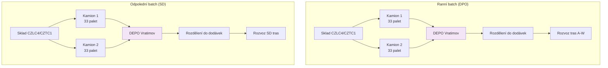

**Klíčové pravidlo:** LH-LH = 2 kamiony pro CELÝ batch, NE per trasa!

---

## 4. Depa a regiony

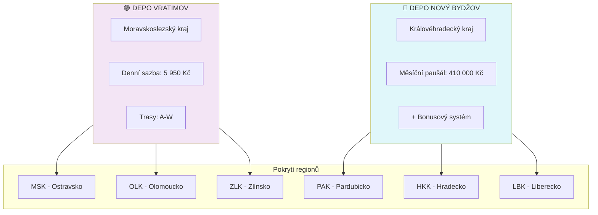

---

## 5. Časová osa dne

```mermaid
gantt
    title Denní provoz dopravy Drivecool
    dateFormat HH:mm
    axisFormat %H:%M
    
    section DPO Linehaul
    Nakládka ve skladu     :a1, 00:00, 1h
    Jízda na DEPO          :a2, 01:00, 2h
    
    section DPO DEPO
    Vyložení kamionů       :b1, 03:00, 1h
    Třídění                :b2, 04:00, 1h
    Nakládka dodávek       :b3, 05:00, 2h
    
    section DPO Rozvoz
    Rozvoz tras A-W        :c1, 07:00, 6h
    
    section SD Linehaul
    Nakládka ve skladu     :d1, 11:00, 1h
    Jízda na DEPO          :d2, 12:00, 2h
    
    section SD DEPO
    Vyložení + třídění     :e1, 14:00, 1h
    Nakládka dodávek       :e2, 15:00, 1h
    
    section SD Rozvoz
    Rozvoz SD tras         :f1, 16:00, 5h
```

---

## 6. Struktura nákladů

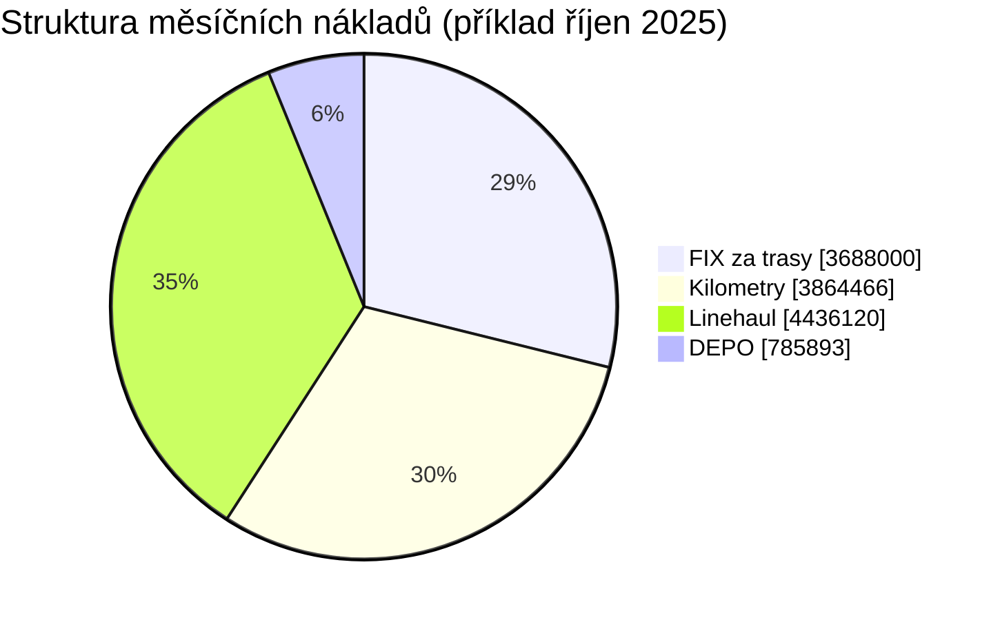

---

## 7. Fakturační tok

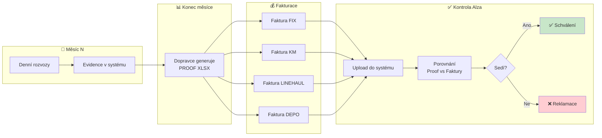

---

## 8. Typy vozidel

| Typ | Kapacita | Použití | Cena (přibližně) |
|-----|----------|---------|------------------|
| 🚛 Kamion | 33 palet | Linehaul | 22 000 - 24 180 Kč |
| 🚚 Sólo | 15-21 palet | Linehaul/Posily | 14 800 - 16 500 Kč |
| 🚐 Dodávka | 8-10 palet | Last mile | 9 100 - 10 100 Kč |
| 🚐 Dodávka 6300 | 6 palet | Last mile (menší) | 6 300 Kč |

---

## 9. Bonusový systém (Nový Bydžov)

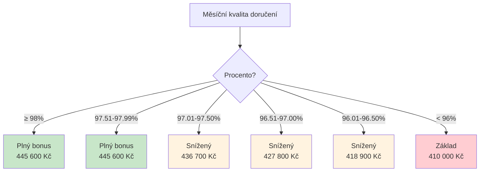

---

## 10. Budoucí rozšíření - další typy doprav

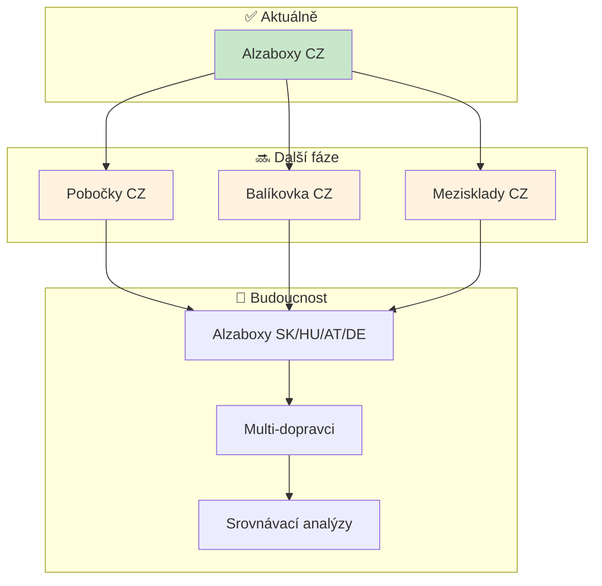

---

*Dokument aktualizován pro Transport Tycoon v3.0*
