# Alza Cost Control - Procesní dokumentace

> **Verze:** 2.1.0  
> **Datum:** Listopad 2025  
> **Zdroj:** Integrace znalostí ze všech konverzací + aktuální codebase

---

## 📊 OBSAH

1. [Přehled systému](#1-přehled-systému)
2. [Procesy aplikace](#2-procesy-aplikace)
3. [Procesy dopravy](#3-procesy-dopravy)
4. [Entity a vztahy](#4-entity-a-vztahy)
5. [Business pravidla](#5-business-pravidla)
6. [Co platí / Neplatí / Neznámé](#6-validace-znalostí)

---

## 1. PŘEHLED SYSTÉMU

### Co aplikace řeší
Kontrola nákladů na dopravu pro Alzu - porovnání:
- **Plánů tras** (co mělo jet)
- **Proofů** (co dopravce tvrdí, že jelo)  
- **Faktur** (co dopravce účtuje)
- **Ceníků** (za kolik to má být)

### Aktuální stav (MVP)
- Jeden dopravce: **Drivecool**
- Jedno hlavní depo: **Vratimov**
- Druhé depo: **Nový Bydžov** (měsíční paušál)

---

## 2. PROCESY APLIKACE

### 2.1 Upload plánu tras (XLSX)

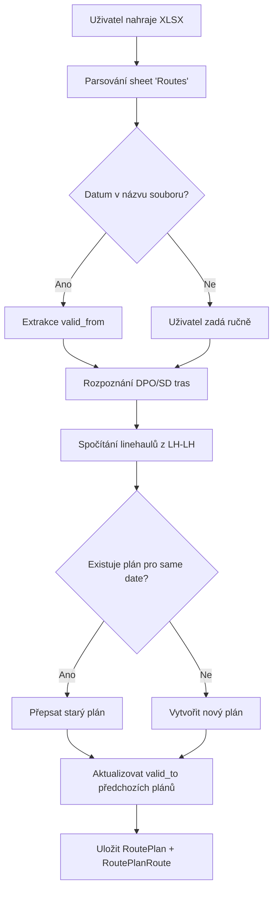

**Klíčová logika:**
- DPO trasa = začátek před 12:00
- SD trasa = začátek od 12:00
- LH-LH = 2 linehauly pro CELÝ batch (ne per trasa!)
- `valid_to` se dopočítá automaticky podle dalšího plánu

---

### 2.2 Upload proofu (XLSX)

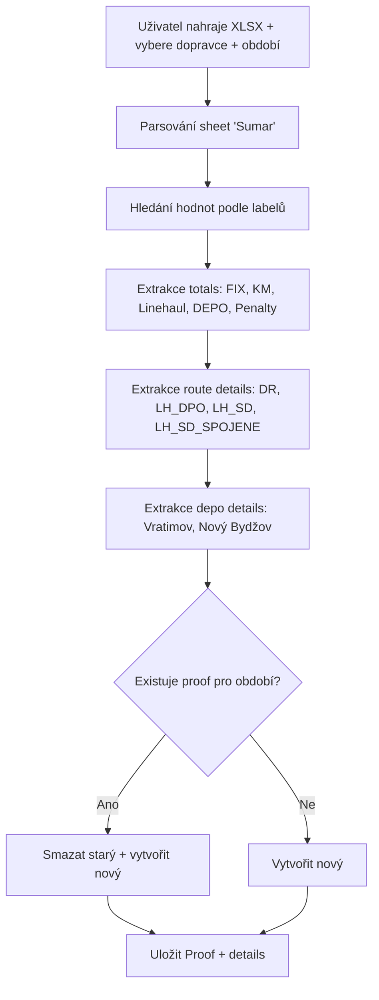

**Labely v XLSX (sloupec B → hodnota D):**
- "Cena FIX" → total_fix
- "Cena KM" → total_km
- "Linehaul" → total_linehaul
- "DEPO" → total_depo
- "Pokuty" → total_penalty
- "Celková částka" → grand_total

---

### 2.3 Upload faktury (PDF)

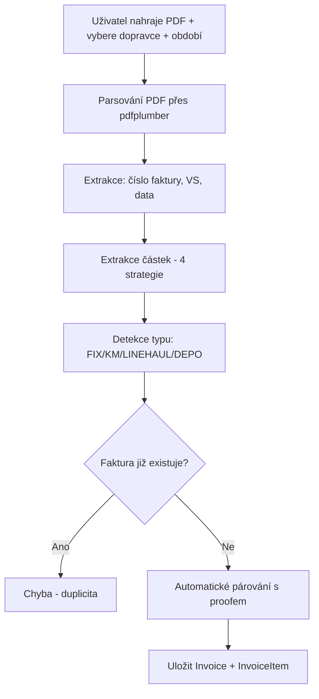

**4 strategie extrakce částek:**
1. Line item match
2. "Součet položek"
3. DPH rekapitulace (základ 21% DPH celkem)
4. "CELKEM K ÚHRADĚ"

---

### 2.4 Upload smlouvy/dodatku (PDF)

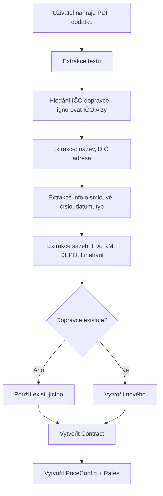

---

### 2.5 Porovnání plán vs. proof

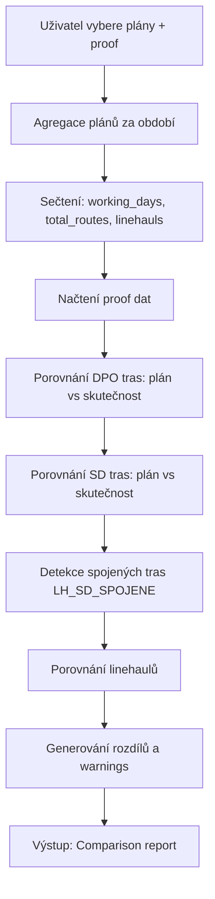

---

### 2.6 Analýza proofu vs. ceník

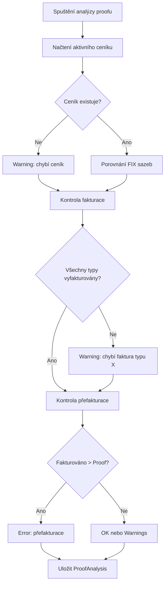

---

## 3. PROCESY DOPRAVY

### 3.1 Hlavní tok zboží

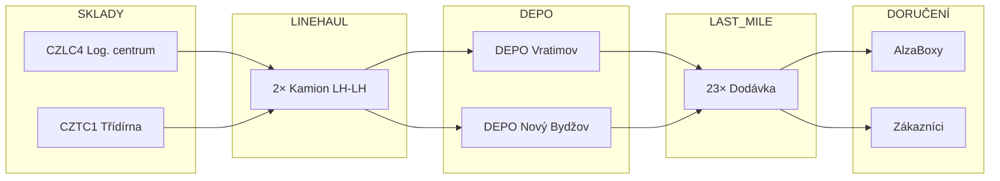

---

### 3.2 Typy rozvozů

```mermaid
flowchart TD
    subgraph DPO ["DPO - Ranní rozvoz"]
        A1[Objednávka do půlnoci] --> A2[Expedice po půlnoci]
        A2 --> A3[Linehaul LH-LH cca 2:00]
        A3 --> A4[Rozvoz od 7:00]
    end
    
    subgraph SD ["SD - Odpolední rozvoz (Same Day)"]
        B1[Objednávka ráno] --> B2[Expedice odpoledne]
        B2 --> B3[Linehaul LH-LH cca 14:00]
        B3 --> B4[Rozvoz od 16:00]
    end
    
    subgraph DR ["DR - Direct Route"]
        C1[Speciální zásilka] --> C2[Přímý rozvoz ze skladu]
        C2 --> C3[Bez průjezdu DEPEM]
    end
```

---

### 3.3 Časová osa denního provozu

```mermaid
gantt
    title Denní provoz dopravy
    dateFormat HH:mm
    axisFormat %H:%M
    
    section DPO
    Linehaul ze skladu     :a1, 00:00, 2h
    Překládka na DEPU      :a2, after a1, 2h
    Nakládka dodávek       :a3, after a2, 2h
    Rozvoz DPO tras        :a4, 07:00, 6h
    
    section SD
    Linehaul ze skladu     :b1, 12:00, 2h
    Překládka na DEPU      :b2, after b1, 1h
    Nakládka dodávek       :b3, after b2, 1h
    Rozvoz SD tras         :b4, 16:00, 5h
```

---

### 3.4 Struktura nákladů

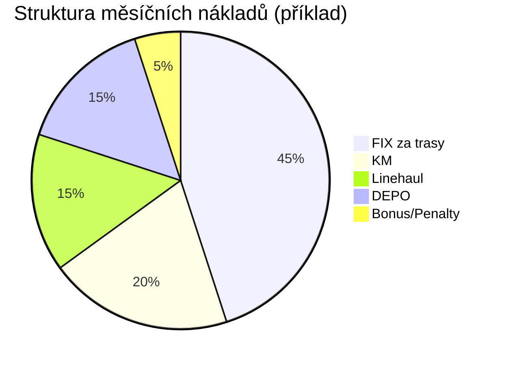

---

## 4. ENTITY A VZTAHY

### 4.1 ER Diagram

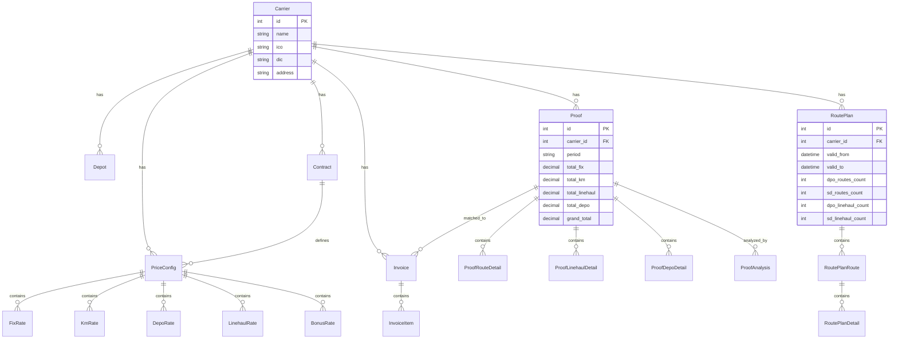

---

### 4.2 Typy tras v systému

| Kód | Název | Popis |
|-----|-------|-------|
| `DR` | Direct Route | Přímý rozvoz ze skladu, bez DEPA |
| `LH_DPO` | Linehaul DPO | Ranní rozvoz (Do Půlnoci Objednáš) |
| `LH_SD` | Linehaul SD | Odpolední rozvoz (Same Day) |
| `LH_SD_SPOJENE` | Spojené SD | 2 trasy spojené do 1 vozidla |

---

### 4.3 Typy DEPO sazeb

| DEPO | Typ sazby | Popis |
|------|-----------|-------|
| Vratimov | Denní | X Kč × počet odpracovaných dnů |
| Nový Bydžov | Měsíční | Paušál ALL IN + skladníci |

---

## 5. BUSINESS PRAVIDLA

### 5.1 Pravidla pro plánování

| # | Pravidlo |
|---|----------|
| P1 | Plán platí od `valid_from` do `valid_to` (nebo do dalšího plánu) |
| P2 | Jeden měsíc může mít více plánů (např. 1.-14. a 15.-30.) |
| P3 | `valid_to` se automaticky přepočítá při uploadu nového plánu |
| P4 | Pracovní dny = pouze Po-Pá |

### 5.2 Pravidla pro linehaul

| # | Pravidlo |
|---|----------|
| L1 | **LH-LH = 2 kamiony pro CELÝ batch, NE per trasa!** |
| L2 | LH-LH pro DPO = 2 kamiony pro všechny ranní rozvozy |
| L3 | LH-LH pro SD = 2 kamiony pro všechny odpolední rozvozy |
| L4 | Linehaul přiváží zboží na DEPO, odkud jedou dodávky |

### 5.3 Pravidla pro proof

| # | Pravidlo |
|---|----------|
| R1 | Pro dopravce existuje max 1 proof za období |
| R2 | Nový upload přepíše existující proof |
| R3 | Celkové trasy = LH_DPO + LH_SD + LH_SD_SPOJENE + DR |

### 5.4 Pravidla pro fakturaci

| # | Pravidlo |
|---|----------|
| F1 | 4 typy faktur: FIX, KM, LINEHAUL, DEPO |
| F2 | Faktura se páruje s proofem podle období + dopravce |
| F3 | DPH je vždy 21% |
| F4 | Kombinace carrier_id + invoice_number musí být unikátní |

### 5.5 Pravidla pro ceníky

| # | Pravidlo |
|---|----------|
| C1 | Aktivní ceník se hledá podle období proofu |
| C2 | Tolerance pro rozdíly: 100 Kč |
| C3 | Sazby se extrahují z PDF dodatků ke smlouvám |

### 5.6 Pravidla pro bonusy (Nový Bydžov)

| Kvalita doručení | Bonus |
|------------------|-------|
| ≥ 98% | Plný bonus |
| 97.51 - 97.99% | Plný bonus |
| 97.01 - 97.50% | Snížený bonus |
| 96.51 - 97.00% | Snížený bonus |
| < 96% | Žádný bonus |

---

## 6. VALIDACE ZNALOSTÍ

### ✅ CO PLATÍ (potvrzeno aktuální codebase)

| Oblast | Detail |
|--------|--------|
| Upload proofu | XLSX parsing sheetu "Sumar", extrakce podle labelů |
| Upload faktury | PDF parsing přes pdfplumber, 4 strategie |
| Upload smlouvy | PDF parsing, extrakce IČO, vytvoření ceníku |
| Upload plánu | XLSX parsing sheetu "Routes", rozpoznání DPO/SD |
| Porovnání plán vs proof | Endpoint `/api/route-plans/{id}/compare/{proof_id}` |
| Entity | Carrier, Proof, Invoice, Contract, PriceConfig, RoutePlan |
| Typy tras | DR, LH_DPO, LH_SD, LH_SD_SPOJENE |
| DEPO | Vratimov (denní), Nový Bydžov (měsíční) |

### ⚠️ CO NEVÍME, ZDA PLATÍ

| Oblast | Poznámka |
|--------|----------|
| Agregace více plánů | V minulém chatu zmíněno, ale v aktuální codebase je porovnání 1:1 |
| PlanComparison entita | Zmíněna v minulém chatu, ale není v models.py |
| working_days výpočet | Zmíněno, ale v route_plans.py se nepočítá |
| routes_per_day | Zmíněno jako atribut, ale není v modelu |

### ❓ NEZNÁMÉ / K DOPLNĚNÍ

| Oblast | Co chybí |
|--------|----------|
| RouteDetails parsing | Připraveno v modelu, ale neukládá se |
| Kvalita doručení | Odkud se bere procento? |
| Posily | Jak se identifikují v proofu? |
| Automatické párování plánů | Jak napárovat správné plány k proofu? |

---

## 7. PŘÍLOHY

### 7.1 Aktuální ceníky (z dodatků)

**AlzaBox (Dodatek č. 9, od 1.7.2025):**
- DIRECT Praha: 3 200 Kč
- DIRECT Vratimov: 2 500 Kč
- Kč/km: 10,97 Kč
- DEPO hodina: 850 Kč

**DROP 2.0 (Dodatek č. 13, od 1.11.2025):**
- Trasy A-I: 8 500 Kč
- Dopoledne: 8 500 Kč
- Posily C, D, H: 11 600 Kč

**Nový Bydžov (Dodatek č. 12, od 1.10.2025):**
- Sklad ALL IN: 410 000 Kč/měs (po slevě 396 000 Kč)
- 4× skladník: 194 800 Kč/měs

---

*Dokument vygenerován integrací znalostí z projektu TransportBrain*
