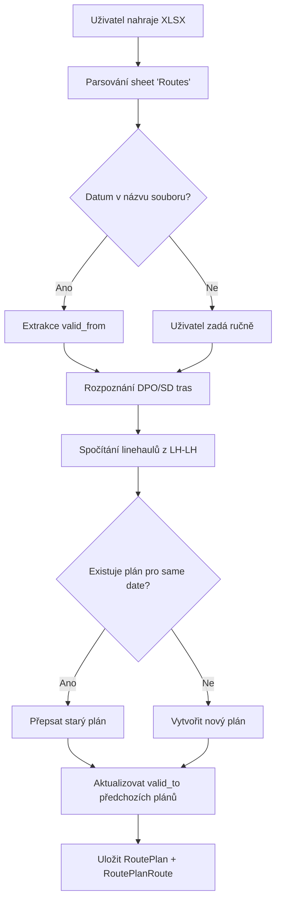
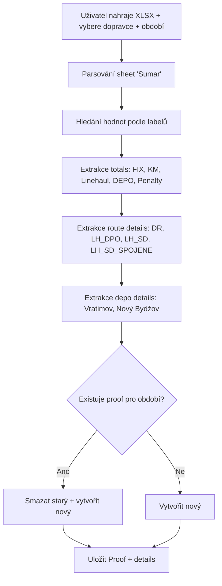
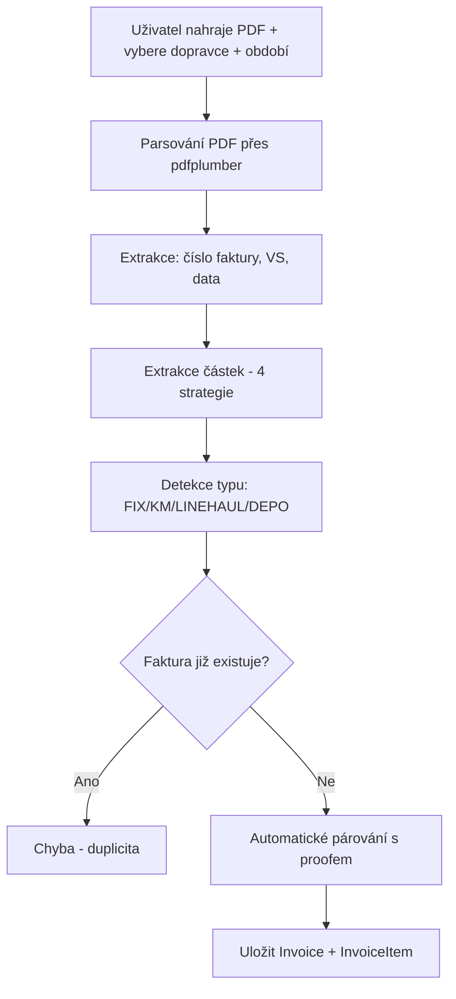
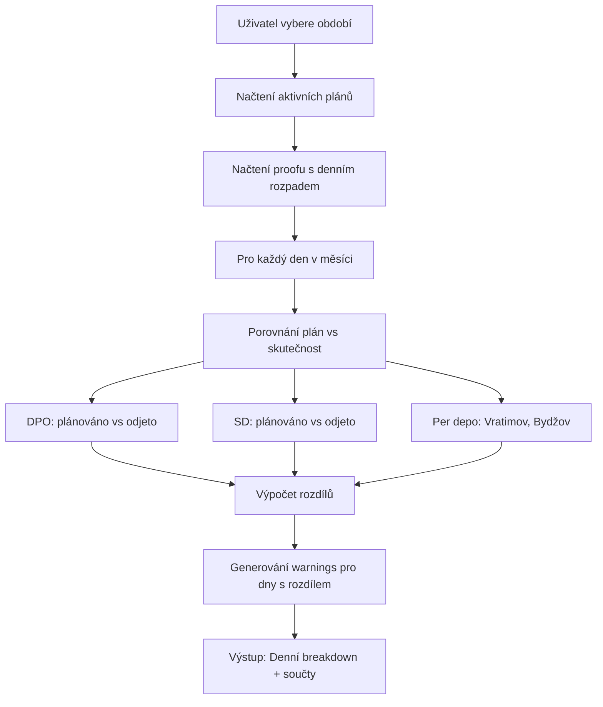
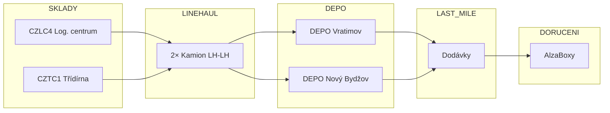
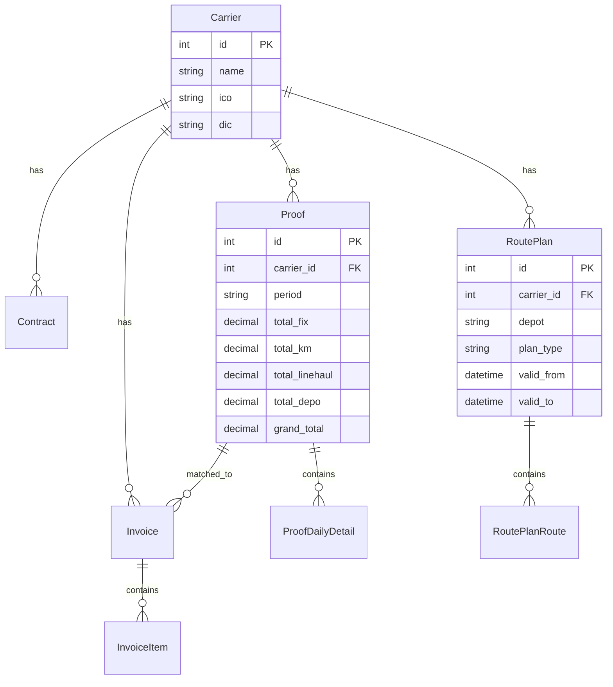
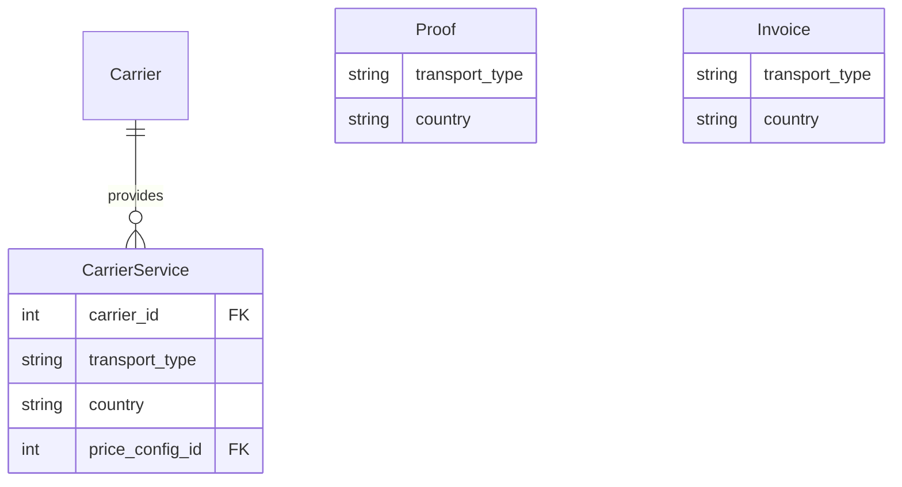

# Alza Cost Control - Procesní dokumentace

> **Verze:** 3.0.0  
> **Datum:** Prosinec 2025  
> **Aktualizace:** Rozšíření o typy doprav a země

---

## 📊 OBSAH

1. [Přehled systému](#1-přehled-systému)
2. [Typy doprav a země](#2-typy-doprav-a-země)
3. [Procesy aplikace](#3-procesy-aplikace)
4. [Procesy dopravy](#4-procesy-dopravy)
5. [Entity a vztahy](#5-entity-a-vztahy)
6. [Business pravidla](#6-business-pravidla)
7. [Roadmapa](#7-roadmapa)

---

## 1. PŘEHLED SYSTÉMU

### Co aplikace řeší
Kontrola nákladů na dopravu pro Alzu - porovnání:
- **Plánů tras** (co mělo jet)
- **Proofů** (co dopravce tvrdí, že jelo)  
- **Faktur** (co dopravce účtuje)
- **Ceníků** (za kolik to má být)

### Aktuální stav (MVP)
- Jeden dopravce: **Drivecool**
- Jeden typ dopravy: **Alzaboxy**
- Jedna země: **Česko (CZ)**
- Dvě depa: **Vratimov**, **Nový Bydžov**

---

## 2. TYPY DOPRAV A ZEMĚ

### 2.1 Typy doprav v Alze

| Kód | Typ dopravy | Popis | Status |
|-----|-------------|-------|--------|
| `ALZABOX` | Alzaboxy | Závoz samoobslužných boxů | ✅ MVP |
| `BRANCH` | Pobočky | Závoz kamenných prodejen | 🔜 Plánováno |
| `PARCEL` | Balíkovka | Doručení na adresu zákazníka | 🔜 Plánováno |
| `TRANSFER` | Mezisklady | Převozy mezi sklady/depy | 🔜 Plánováno |
| `RETURN` | Vratky | Svoz vratek od zákazníků | 🔜 Plánováno |

### 2.2 Země operací

| Kód | Země | Měna | Status |
|-----|------|------|--------|
| `CZ` | 🇨🇿 Česko | CZK | ✅ MVP |
| `SK` | 🇸🇰 Slovensko | EUR | 🔜 Plánováno |
| `HU` | 🇭🇺 Maďarsko | HUF | 🔜 Plánováno |
| `AT` | 🇦🇹 Rakousko | EUR | 🔜 Plánováno |
| `DE` | 🇩🇪 Německo | EUR | 🔜 Plánováno |

### 2.3 Matice dopravce × typ × země

```
Dopravce může operovat:
- Více typů doprav (např. Alzaboxy + Pobočky)
- Ve více zemích (např. CZ + SK)
- S různými ceníky per typ × země
```

**Příklad budoucí struktury:**

| Dopravce | Typ dopravy | Země | Ceník |
|----------|-------------|------|-------|
| Drivecool | ALZABOX | CZ | Dodatek 12 |
| Drivecool | BRANCH | CZ | Dodatek 15 |
| TransportSK | ALZABOX | SK | Smlouva SK-001 |
| TransportSK | ALZABOX | HU | Smlouva HU-001 |

---

## 3. PROCESY APLIKACE

### 3.1 Upload plánu tras (XLSX)



**Klíčová logika:**
- DPO trasa = začátek před 12:00
- SD trasa = začátek od 12:00
- LH-LH = 2 linehauly pro CELÝ batch (ne per trasa!)
- `valid_to` se dopočítá automaticky podle dalšího plánu

---

### 3.2 Upload proofu (XLSX)



**Dual-format podpora:**
- Září 2025 (starý formát): 2 sloupce/den, bez DPO/SD rozdělení
- Říjen 2025+ (nový formát): 4 sloupce/den, DPO/SD + depo rozdělení

---

### 3.3 Upload faktury (PDF)



---

### 3.4 Porovnání plán vs. proof



---

## 4. PROCESY DOPRAVY

### 4.1 Hlavní tok zboží (Alzaboxy CZ)



---

### 4.2 Typy rozvozů

| Kód | Název | Popis | Časování |
|-----|-------|-------|----------|
| `DPO` | Ranní rozvoz | Do Půlnoci Objednáš | Rozvoz od 7:00 |
| `SD` | Same Day | Objednávka ráno | Rozvoz od 16:00 |
| `DR` | Direct Route | Přímý rozvoz ze skladu | Bez průjezdu DEPEM |

---

### 4.3 Struktura nákladů

| Složka | Popis | Příklad sazby |
|--------|-------|---------------|
| FIX | Paušál za trasu | 2 500 - 3 200 Kč |
| KM | Variabilní za km | 10,97 Kč/km |
| Linehaul | Svoz ze skladu | 9 500 - 24 180 Kč |
| DEPO | Nájem/provoz depa | 5 950 Kč/den nebo měsíční paušál |
| Posily | Extra vozidla | 10 100 - 16 500 Kč |
| Pokuty/Bonusy | Kvalita doručení | ±50 000 Kč |

---

## 5. ENTITY A VZTAHY

### 5.1 ER Diagram (aktuální)



### 5.2 Budoucí rozšíření entit



---

## 6. BUSINESS PRAVIDLA

### 6.1 Pravidla pro plánování

| # | Pravidlo |
|---|----------|
| P1 | Plán platí od `valid_from` do `valid_to` (nebo do dalšího plánu) |
| P2 | Jeden měsíc může mít více plánů (např. 1.-14. a 15.-30.) |
| P3 | Plány se dělí podle depa (Vratimov, Bydžov) a typu (DPO, SD, BOTH) |

### 6.2 Pravidla pro linehaul

| # | Pravidlo |
|---|----------|
| L1 | **LH-LH = 2 kamiony pro CELÝ batch, NE per trasa!** |
| L2 | Různé sazby podle trasy: CZLC4→Vratimov vs CZTC1→Bydžov |

### 6.3 Pravidla pro fakturaci

| # | Pravidlo |
|---|----------|
| F1 | Typicky 4-6 faktur za období: FIX, KM, LINEHAUL, DEPO, případně POSILY |
| F2 | Všechny částky bez DPH |
| F3 | Párování: Proof.grandTotal = Σ Invoice.totalWithoutVat |

---

## 7. ROADMAPA

### Fáze 1: MVP Alzaboxy CZ ✅
- [x] Dopravce Drivecool
- [x] Depa Vratimov + Nový Bydžov
- [x] Upload proofů, faktur, plánů
- [x] Porovnání plán vs proof
- [x] Dashboard s přehledem

### Fáze 2: Business Intelligence Alzaboxy 🔄
- [ ] Import dat Alzaboxů (lokace, časy dojezdů)
- [ ] Analýzy pokrytí a efektivity
- [ ] Vizualizace na mapě
- [ ] KPIs a metriky

### Fáze 3: Více dopravců CZ
- [ ] Podpora více dopravců pro Alzaboxy
- [ ] Srovnávací analýzy dopravců

### Fáze 4: Další typy doprav
- [ ] Pobočky (BRANCH)
- [ ] Balíkovka (PARCEL)
- [ ] Mezisklady (TRANSFER)

### Fáze 5: Mezinárodní rozšíření
- [ ] Slovensko (SK)
- [ ] Maďarsko (HU)
- [ ] Rakousko (AT)
- [ ] Německo (DE)

---

*Dokument aktualizován pro Transport Tycoon v3.0*
