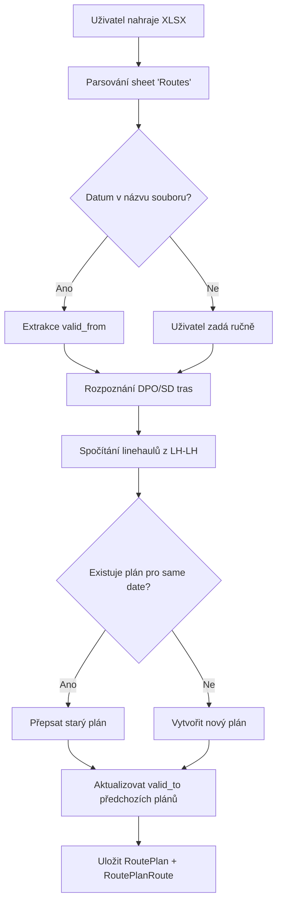
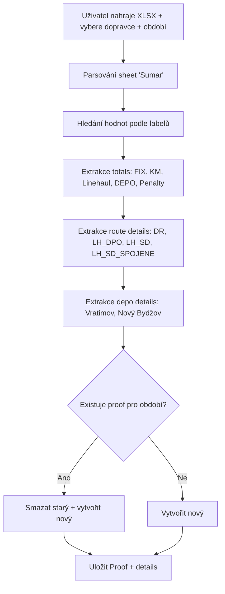
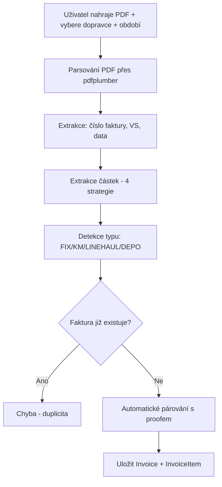
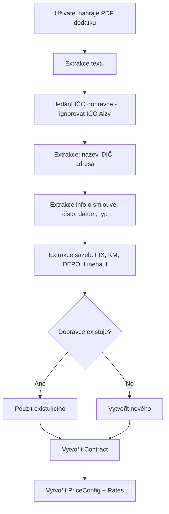
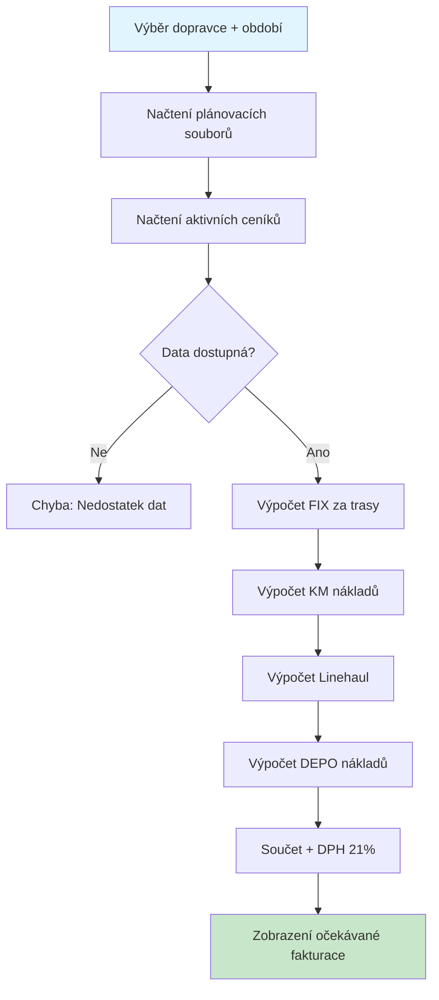
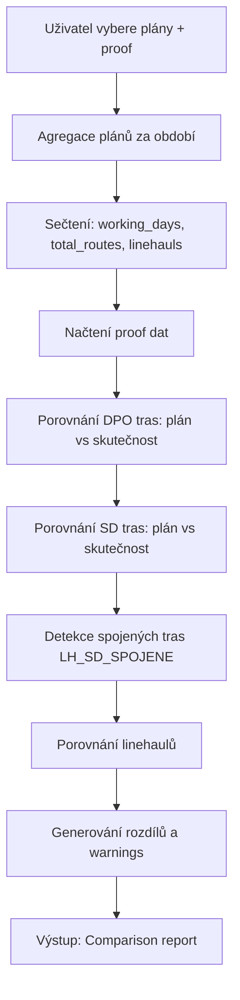
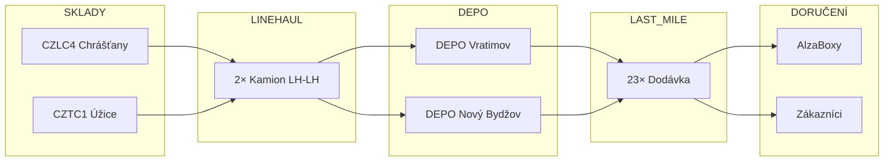
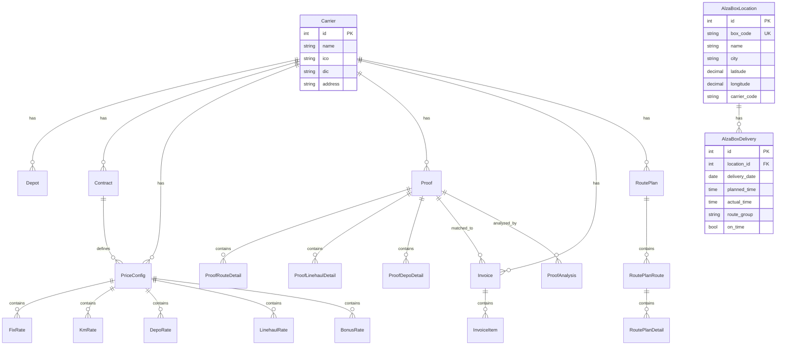
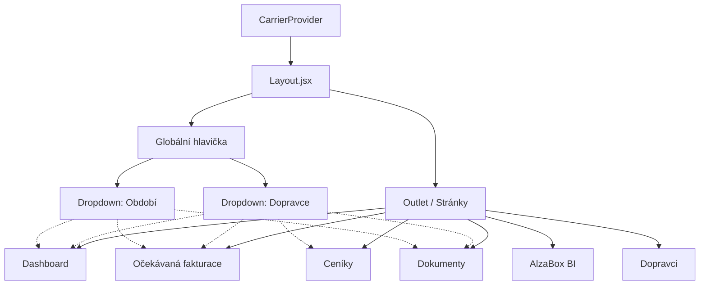

# Alza Cost Control - Procesní dokumentace

> **Verze:** 3.11.0  
> **Datum:** Prosinec 2025  
> **Zdroj:** Integrace znalostí ze všech konverzací + aktuální codebase

---

## 📊 OBSAH

1. [Přehled systému](#1-přehled-systému)
2. [Procesy aplikace](#2-procesy-aplikace)
3. [Procesy dopravy](#3-procesy-dopravy)
4. [Entity a vztahy](#4-entity-a-vztahy)
5. [Business pravidla](#5-business-pravidla)
6. [Frontend architektura](#6-frontend-architektura)
7. [Co platí / Neplatí / Neznámé](#7-validace-znalostí)

---

## 1. PŘEHLED SYSTÉMU

### Co aplikace řeší
Kontrola nákladů na dopravu pro Alzu - porovnání:
- **Plánů tras** (co mělo jet)
- **Proofů** (co dopravce tvrdí, že jelo)  
- **Faktur** (co dopravce účtuje)
- **Ceníků** (za kolik to má být)
- **AlzaBox BI** (analýza včasnosti dojezdů k AlzaBoxům)

### Aktuální stav (MVP)
- Hlavní dopravce: **Drivecool**
- Další dopravci: **ASEN Logistic Group**, další přidáváni ze smluv
- Hlavní depo: **Vratimov**
- Druhé depo: **Nový Bydžov** (měsíční paušál)
- Expediční sklady: **CZLC4** (Chrášťany), **CZTC1** (Úžice)

---

## 2. PROCESY APLIKACE

### 2.1 Upload plánu tras (XLSX)



**Klíčová logika:**
- DPO trasa = začátek před 12:00
- SD trasa = začátek od 12:00
- LH-LH = 2 linehauly pro CELÝ batch (ne per trasa!)
- `valid_to` se dopočítá automaticky podle dalšího plánu

---

### 2.2 Upload proofu (XLSX)



**Labely v XLSX (sloupec B → hodnota D):**
- "Cena FIX" → total_fix
- "Cena KM" → total_km
- "Linehaul" → total_linehaul
- "DEPO" → total_depo
- "Pokuty" → total_penalty
- "Celková částka" → grand_total

---

### 2.3 Upload faktury (PDF)



**4 strategie extrakce částek:**
1. Line item match
2. "Součet položek"
3. DPH rekapitulace (základ 21% DPH celkem)
4. "CELKEM K ÚHRADĚ"

---

### 2.4 Upload smlouvy/dodatku (PDF)



---

### 2.5 AlzaBox Import (XLSX) - NOVÉ v3.10

```mermaid
flowchart TD
    A[Uživatel nahraje XLSX lokací] --> B[Detekce sheetu: LL_PS / Sheet1 / Data]
    B --> C[Parsování sloupců: kód, název, GPS, dopravce]
    C --> D[Uložení AlzaBoxLocation - globální data]
    
    E[Uživatel nahraje XLSX dojezdů] --> F[Detekce sheetů: Actual + Plan]
    F --> G[Parsování datumů z row 2]
    G --> H[Regex extrakce: čas | název -- AB1234]
    H --> I[Párování s lokacemi podle box_code]
    I --> J[Uložení AlzaBoxDelivery]
    
    D --> K[Dashboard statistiky]
    J --> K
    K --> L[Graf včasnosti dojezdů]
    
    style A fill:#e1f5fe
    style E fill:#e1f5fe
    style L fill:#c8e6c9
```

**Formát XLSX dojezdů:**
- Sheet "Actual" a "Plan" (nebo "Skutecnost")
- Row 2: datumy (datetime objekty)
- Row 3+: `"09:00 | Brno - Bystrc (OC Max) -- AB1688"` nebo hlavička trasy (bez `|` a `--`)

---

### 2.6 Očekávaná fakturace - NOVÉ v3.10



**Výstup:**
- Celkem bez DPH / s DPH
- Rozpis: FIX, KM, Linehaul, DEPO
- Použité plánovací soubory

---

### 2.7 Porovnání plán vs. proof



---

## 3. PROCESY DOPRAVY

### 3.1 Hlavní tok zboží



---

### 3.2 Typy rozvozů

```mermaid
flowchart TD
    subgraph DPO ["DPO - Ranní rozvoz"]
        A1[Objednávka do půlnoci] --> A2[Expedice po půlnoci]
        A2 --> A3[Linehaul LH-LH cca 2:00]
        A3 --> A4[Rozvoz od 7:00]
    end
    
    subgraph SD ["SD - Odpolední rozvoz (Same Day)"]
        B1[Objednávka ráno] --> B2[Expedice odpoledne]
        B2 --> B3[Linehaul LH-LH cca 14:00]
        B3 --> B4[Rozvoz od 16:00]
    end
    
    subgraph DR ["DR - Direct Route"]
        C1[Speciální zásilka] --> C2[Přímý rozvoz ze skladu]
        C2 --> C3[Bez průjezdu DEPEM]
    end
```



---

## 4. ENTITY A VZTAHY

### 4.1 ER Diagram



---

### 4.2 Typy tras v systému

| Kód | Název | Popis |
|-----|-------|-------|
| `DR` | Direct Route | Přímý rozvoz ze skladu, bez DEPA |
| `LH_DPO` | Linehaul DPO | Ranní rozvoz (Do Půlnoci Objednáš) |
| `LH_SD` | Linehaul SD | Odpolední rozvoz (Same Day) |
| `LH_SD_SPOJENE` | Spojené SD | 2 trasy spojené do 1 vozidla |

---

## 5. BUSINESS PRAVIDLA

### 5.1 Pravidla pro linehaul

| # | Pravidlo |
|---|----------|
| L1 | **LH-LH = 2 kamiony pro CELÝ batch, NE per trasa!** |
| L2 | LH-LH pro DPO = 2 kamiony pro všechny ranní rozvozy |
| L3 | LH-LH pro SD = 2 kamiony pro všechny odpolední rozvozy |
| L4 | Linehaul přiváží zboží na DEPO, odkud jedou dodávky |
| L5 | Linehaul jede z CZLC4 (Chrášťany) nebo CZTC1 (Úžice) do dep |

### 5.2 Pravidla pro ceníky

| # | Pravidlo |
|---|----------|
| C1 | Aktivní ceník se hledá podle období proofu |
| C2 | Tolerance pro rozdíly: 100 Kč |
| C3 | Sazby se extrahují z PDF dodatků ke smlouvám |
| C4 | Ceníky jsou per dopravce, seskupené podle depa |
| C5 | Jedna služba = jedna nejnovější cena |

### 5.3 Pravidla pro bonusy (Nový Bydžov)

| Kvalita doručení | Bonus |
|------------------|-------|
| ≥ 98% | Plný bonus |
| 97.51 - 97.99% | Plný bonus |
| 97.01 - 97.50% | Snížený bonus |
| < 96% | Žádný bonus |

---

## 6. FRONTEND ARCHITEKTURA

### 6.1 Globální CarrierContext

Stránky sdílejí vybraného dopravce a období přes React Context:



### 6.2 Nastavení stránek

| Stránka | Cesta | needsCarrier | needsPeriod |
|---------|-------|--------------|-------------|
| Fakturace | `/dashboard` | ✅ | ✅ |
| Očekávaná fakturace | `/expected-billing` | ✅ | ✅ |
| Ceníky | `/prices` | ✅ | ❌ |
| Dokumenty | `/upload` | ✅ | ✅ |
| AlzaBox BI | `/alzabox` | ❌ | ❌ |
| Dopravci | `/carriers` | ❌ | ❌ |

### 6.3 Struktura zobrazení ceníků

```
Dopravce: [Drivecool ▼] (globální výběr v hlavičce)

📍 Vratimov
├── Rozvoz (FIX za trasu)
│   ├── DIRECT Praha (DPO)    3,200 Kč  [D7]
│   └── DIRECT Vratimov       2,500 Kč  [D7]
├── Variabilní náklady
│   └── Kč/km                 10,97 Kč  [D7]
└── Line-haul
    ├── CZLC4 → Vratimov (Kamion)  24,180 Kč  [D8]
    └── CZTC1 → Vratimov (Kamion)  22,000 Kč  [D8]

📍 Nový Bydžov
├── Rozvoz (FIX za trasu)
│   └── DIRECT DPO            2,500 Kč  [D12]
└── Náklady depa
    ├── Sklad ALL IN        410,000 Kč/měs  [D12]
    └── Personál            194,800 Kč/měs  [D12]
```

---

## 7. VALIDACE ZNALOSTÍ

### ✅ CO PLATÍ (potvrzeno aktuální codebase)

| Oblast | Detail |
|--------|--------|
| Upload proofu | XLSX parsing sheetu "Sumar", extrakce podle labelů |
| Upload faktury | PDF parsing přes pdfplumber, 4 strategie |
| Upload smlouvy | PDF parsing, extrakce IČO, vytvoření ceníku |
| Upload plánu | XLSX parsing sheetu "Routes", rozpoznání DPO/SD |
| AlzaBox import | XLSX dual-format parser (Actual/Plan nebo Skutecnost) |
| Globální context | CarrierContext pro sdílení dopravce/období mezi stránkami |
| Entity | Carrier, Proof, Invoice, Contract, PriceConfig, RoutePlan, AlzaBoxLocation, AlzaBoxDelivery |
| Typy tras | DR, LH_DPO, LH_SD, LH_SD_SPOJENE |
| DEPO | Vratimov (denní), Nový Bydžov (měsíční) |
| Expediční sklady | CZLC4 = Chrášťany, CZTC1 = Úžice |

### ❓ NEZNÁMÉ / K DOPLNĚNÍ

| Oblast | Co chybí |
|--------|----------|
| RouteDetails parsing | Připraveno v modelu, ale neukládá se |
| Kvalita doručení | Odkud se bere procento? |
| Posily | Jak se identifikují v proofu? |

---

## 8. PŘÍLOHY

### 8.1 API Routing (main.py)

```python
# Všechny routery mají prefix definovaný v main.py
app.include_router(auth.router, prefix="/api/auth", tags=["Auth"])
app.include_router(carriers.router, prefix="/api/carriers", tags=["Carriers"])
app.include_router(contracts.router, prefix="/api/contracts", tags=["Contracts"])
app.include_router(prices.router, prefix="/api/prices", tags=["Prices"])
app.include_router(proofs.router, prefix="/api/proofs", tags=["Proofs"])
app.include_router(invoices.router, prefix="/api/invoices", tags=["Invoices"])
app.include_router(alzabox.router, prefix="/api/alzabox", tags=["AlzaBox"])
```

### 8.2 Timeouty API volání

| Endpoint | Timeout | Důvod |
|----------|---------|-------|
| Default | 30s | Standardní operace |
| AlzaBox import | 300s (5 min) | Velké XLSX soubory (2.5-3 MB) |
| Proofs upload | 180s (3 min) | Zpracování XLSX |
| Contracts upload | 120s (2 min) | PDF parsing |

---

*Dokument vygenerován integrací znalostí z projektu TransportBrain v3.11.0*
